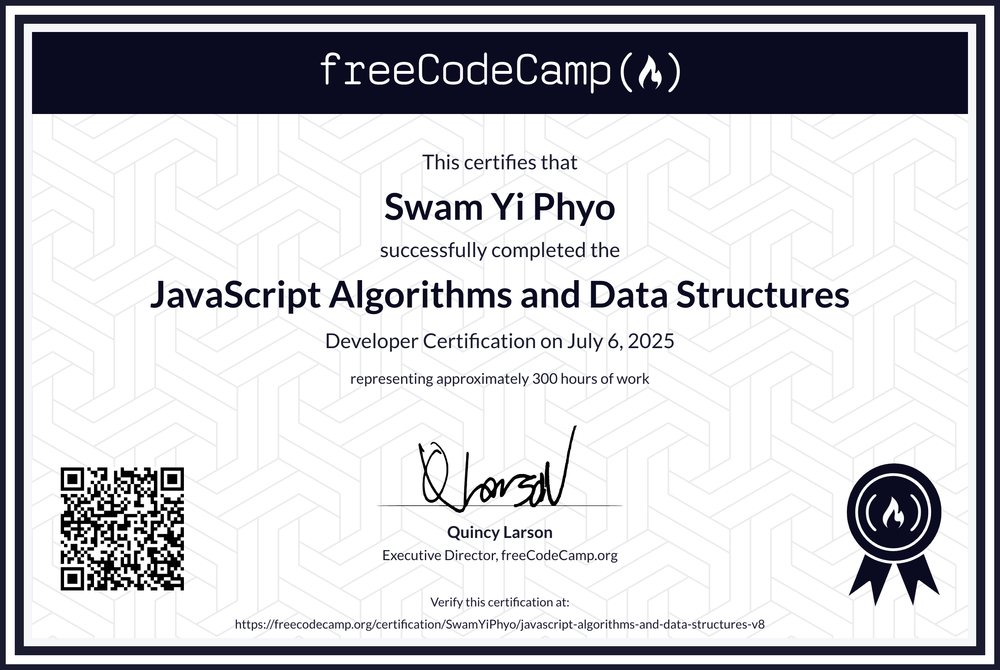

## JavaScript Algorithms and Data Structures Certification (freeCodeCamp)

The **freeCodeCamp** JavaScript Data Structures and Algorithms course is a hands-on introduction to real-world coding. You’ll start by learning how to write and organize JavaScript code, mastering essentials like data types, functions, loops, and conditionals.

As you progress, you’ll explore powerful programming paradigms like object-oriented and functional programming. The course also walks you through solving algorithms step-by-step, improving your logical thinking and coding confidence.

By the end, you’ll know how to manipulate the DOM, store data in the browser with localStorage, and interact with external services using APIs—all using pure JavaScript. It’s an excellent path for anyone looking to strengthen their problem-solving skills and become a more capable developer.

## Lessons Learned
I could spend all day describing the lessons that I learned while taking this course, but the most important ones involved in my newfound understanding of data structures and algorithms. I always felt uncertain when it came to data structures and algorithms. I was somewhat familiar with the concepts, but I lacked a clear and confident understanding. I was stuck in different places, but the most difficult area was in the module 4 certification project which is builing cash register project. I have to do data manipulations with 2D arrays which is first time for me to do, which initially felt overwhelming. With some focused research, I managed to make it work smoothly. This course helped me not just learning the theory, but also applying it through hands-on coding challenges. It gave me the clarity I needed and boosted my confidence in solving problems efficiently.